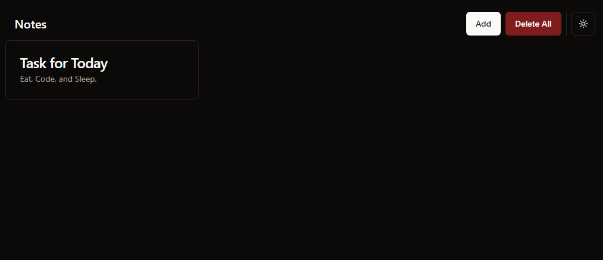
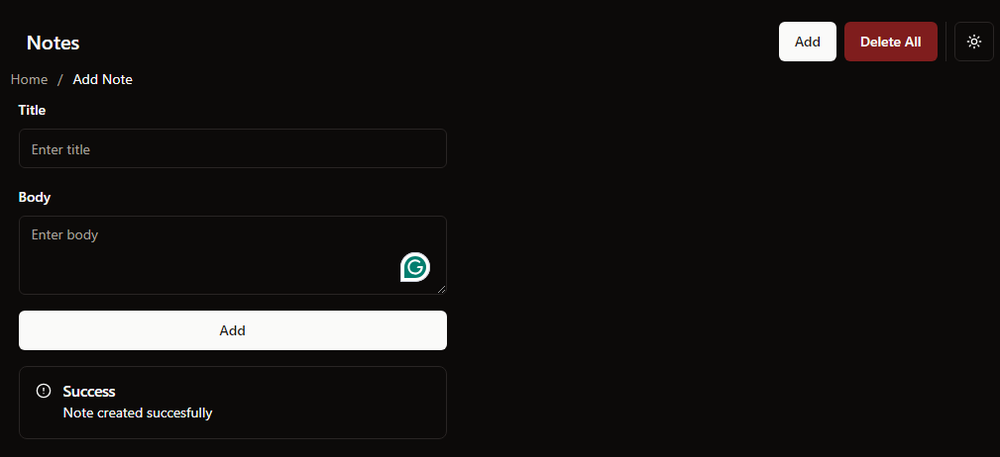
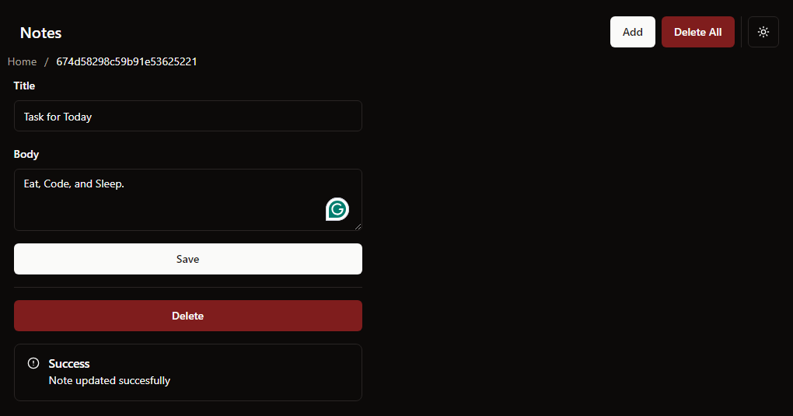

# Prisma + Zustand

##### A simple REST API CRUD using these tech stacks:


| Tool       | Description                                                                           |
| ---------- | ------------------------------------------------------------------------------------- |
| TypeScript | Adds static typing to JavaScript, reducing bugs and improving maintainability.        |
| React      | JavaScript library for building user interfaces, especially single-page applications. |
| Zustand    | A small, fast, and scalable state management tool for React.                          |
| Zod        | Runtime schema validation for TypeScript.                                             |
| ESLint     | Linter for maintaining code quality and consistency.                                  |
| Prettier   | Code formatter for consistent and clean codestyle.                                    |

## Features

✅ Axios for API requests

✅ Zustand for state management

✅ Linting and formatting with eslint and prettier

✅ Commit hooks with husky

✅ Automates building, linting, and formatting using GitHub Actions.

✅ Error handlers

✅ Ensures consistent file naming convention

## Pages

HomePage.tsx



AddNotePage.tsx



ViewNotePage.tsx



## Clone the project

```
git clone https://github.com/patriki28/react-zustand-example.git
```

Go to the project directory

```
cd react-zustand-example
```

## Environment setup

Create a .env file

```
VITE_API_KEY=
```

## Scripts

Following are the list of predefined scripts available in the app

| Script Name  | Description                                                  | Command              |
| ------------ | ------------------------------------------------------------ | -------------------- |
| build        | Builds the app with tsc to dist folder.                      | npm run build        |
| dev          | Runs the app in watch mode with TypeScript paths registered. | npm run dev          |
| test         | Runs tests.                                                  | npm run test         |
| lint         | Lints the files with eslint.                                 | npm run lint         |
| lint:fix     | Lints and fixes files with eslint.                           | npm run lint:fix     |
| prettier     | Check the format of files with prettier.                     | npm run prettier     |
| prettier:fix | Format files with prettier.                                  | npm run prettier:fix |
| format       | Format files with prettier and eslint.                       | npm run format       |
| shadcn:add   | Add new shadcn/ui component                                  | npm run shadcn:add   |
| commit       | Opens commitizen.                                            | npm run commit       |

## Folder structure

```
├── src
 ├── assets
 ├── components
 ├── config
 ├── context
 ├── data
 ├── features
 ├── lib
 ├── pages
 ├── routes
 └── utils
```

| Folder     | Description                                                                                                                                               |
| ---------- | --------------------------------------------------------------------------------------------------------------------------------------------------------- |
| src        | Source folder                                                                                                                                             |
| assets     | Contains static assets like images, fonts, and other media files used in the app.                                                                         |
| components | Contains reusable UI components used across various pages in the app.                                                                                     |
| config     | Contains configuration files for the whole app and different libraries.                                                                                   |
| context    | Contains React context providers for managing global state across the app.                                                                                |
| data       | Contains data models and mock data files used for testing or initialization.                                                                              |
| features   | Includes feature-specific components and logic, typically following a modular structure (e.g., notes crud, ).                                             |
| lib        | Contains any external libraries or modules that the app may depend on, as well as any custom utility functions or classes that you have written yourself. |
| pages      | Contains the various pages in the app (e.g., home, addnote, viewnote).                                                                                    |
| routes     | Defines the app's routing logic and any route-related configuration.                                                                                      |
| utils      | Contains utility functions or classes that can be used throughout the app for common tasks.                                                               |
